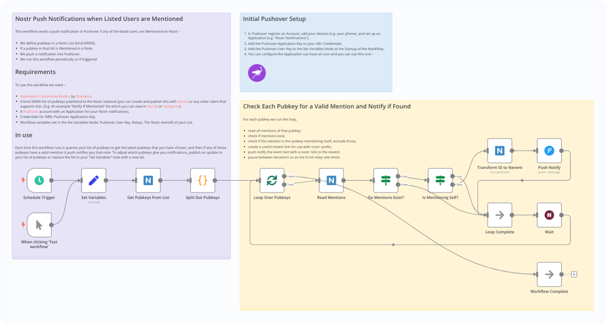
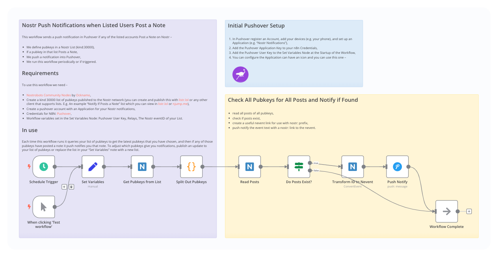
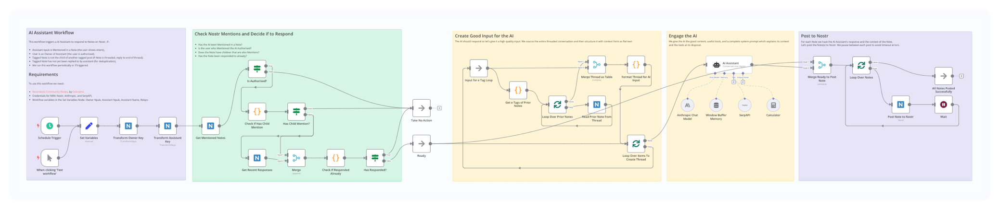

# Nostr-n8n

Nostr is a new protocol for adding a social layer to the Internet. n8n is a workflow automation tool. This repository contains workflows which use n8n with Nostr to augment a Nostr user's experience on the network.

My intent it to publish a variety of useful workflows.

## Prerequisites

- **n8n**: Install a self-hosted n8n on your system. You can follow the instructions from the [n8n website](https://docs.n8n.io/hosting/),
- **Nostrobots**: Install [Nostrobots Community Nodes](https://github.com/ocknamo/n8n-nodes-nostrobots/tree/main) by [Ocknamo](https://njump.me/npub1y6aja0kkc4fdvuxgqjcdv4fx0v7xv2epuqnddey2eyaxquznp9vq0tp75l) with instructions from the [n8n website](https://docs.n8n.io/integrations/community-nodes/installation/),
- **Add workflow from Github to n8n**: For the workflow of your choice 1. In Github copy the URL for the Raw .json ([example](https://github.com/r0d8lsh0p/nostr-n8n/raw/refs/heads/main/Nostr_AI_Assistant.json)), 2. In n8n create a new workflow, then click "..." and "Import from URL",
- **Credentials**: Add whatever credentials are required by the Nodes,
- **Settings**: Specify whatever settings are required by the workflow. Typically all required settings are placed in a "Set" Node at the start of the workflow following the Trigger Node.

## Contents

- [Nostr Simple Post](#nostr-simple-post)
- [Nostr Push Notify if Mentioned](#nostr-push-notify-if-mentioned)
- [Nostr Push Notify If Posts a Note](#nostr-push-notify-if-posts-a-note)
- [Nostr AI Assistant](#nostr-ai-assistant)

## Nostr Simple Post

The "Nostr Form to Post a Note" workflow powers a Npub of your choosing, and allows you to delegate the ability to post notes from that Npub without needing to handover the private keys.

The workflow is designed to be a very simple example of Nostr, Nostrobots and n8n working together.

#### Set up Nostr Simple Post

- **Prerequisites**: Complete the prerequisites as above to have a working n8n instance with Nostrobots Community Nodes installed,
- **Add cedentials for n8n**: Nostr user private key, and (optional) username and password for the form,
- **Set workflow variables in the Set Variables Node**: Nostr Relays,
- **To use**: Turn the workflow to Active. Give the URL, username, and password to the person you would like to post notes,
- **To revoke access**: Change the form username and password, or deactivate the workflow.

## Nostr Push Notify If Mentioned

The "Nostr Push Notify If Mentioned" workflow sends a push notification in Pushover if any of the listed accounts are Mentioned on Nostr.

You can use this to make sure you never miss a Note that mentions you. You can receive push notifications on as many accounts as you like, and push them to all of your devices. 

Pushover requires a small one-time payment per device you register, and has a free trial.

How it works–

- We define pubkeys in a Nostr List (kind:30000),
- If a pubkey in that list is Mentioned in a Note,
- We push a notification into Pushover,
- We run this workflow periodically or if triggered.

#### Set up Nostr Push Notify If Mentioned

- **Prerequisites**: Complete the prerequisites as above to have a working n8n instance with Nostrobots Community Nodes installed,
- **Create a List on Nostr**: A kind 30000 list of pubkeys published to the Nostr network (you can create and publish this with [listr.lol](https://listr.lol) or any other client that supports lists. (E.g. An example "Notify If Mentioned" list which you can view in [listr.lol](https://listr.lol/npub1r0d8u8mnj6769500nypnm28a9hpk9qg8jr0ehe30tygr3wuhcnvs4rfsft/30000/naddr1qvzqqqr4xqpzqx760c0h894a5tg7lxgr8k506twrv2qs0yxln0nz7kgs8zae03xeqy2hwumn8ghj7un9d3shjtnyv9kh2uewd9hj7qghwaehxw309aex2mrp0yhxummnw3ezucnpdejz7qghwaehxw309aex2mrp0yh8qunfd4skctnwv46z7qg4waehxw309aex2mrp0yhxgctdw4eju6t09uq3wamnwvaz7tmjv4kxz7fwdehhxarj9e3xzmny9uqz5mrfwd68ytfevf3r2vnyvsmz6ef389nz6dpnxd3z6cfcxajz6ct9xa3xyefcvgmrjerp4rqr8f) or [njump.me](https://njump.me/naddr1qvzqqqr4xqpzqx760c0h894a5tg7lxgr8k506twrv2qs0yxln0nz7kgs8zae03xeqy2hwumn8ghj7un9d3shjtnyv9kh2uewd9hj7qghwaehxw309aex2mrp0yhxummnw3ezucnpdejz7qghwaehxw309aex2mrp0yh8qunfd4skctnwv46z7qg4waehxw309aex2mrp0yhxgctdw4eju6t09uq3wamnwvaz7tmjv4kxz7fwdehhxarj9e3xzmny9uqz5mrfwd68ytfevf3r2vnyvsmz6ef389nz6dpnxd3z6cfcxajz6ct9xa3xyefcvgmrjerp4rqr8f)),
- **Create a Pushover account**: With an Application for your Nostr notifications,
- **Add cedentials for n8n**: Pushover Application Key,
- **Set workflow variables in the Set Variables Node**: Pushover User Key, Nostr Relays, The Nostr eventID of your List,
- **Go Live**: Turn workflow to Active.

## Nostr Push Notify If Posts a Note

The "Nostr Push Notify If Posts a Note" workflow sends a push notification in Pushover if any of the listed accounts Post a Note on Nostr.

You can use this to make sure you never miss a note from your favourite follows, or to keep an eye on team or Assistant accounts so you can be aware of when they post. You can receive push notifications on as many accounts as you like, and push them to all of your devices. 

Pushover requires a small one-time payment per device you register, and has a free trial.

How it works–

- We define pubkeys in a Nostr List (kind:30000),
- If a pubkey in that list Posts a Note,
- We push a notification into Pushover,
- We run this workflow periodically or if triggered.

#### Set up Nostr Push Notify If Posts a Note

- **Prerequisites**: Complete the prerequisites as above to have a working n8n instance with Nostrobots Community Nodes installed,
- **Create a List on Nostr**: Create a kind 30000 list of pubkeys published to the Nostr network (you can create and publish this with [listr.lol](https://listr.lol) or any other client that supports lists. E.g. An example "Notify If Posts a Note" list which you can view in [listr.lol](https://listr.lol/npub1r0d8u8mnj6769500nypnm28a9hpk9qg8jr0ehe30tygr3wuhcnvs4rfsft/30000/naddr1qvzqqqr4xqpzqx760c0h894a5tg7lxgr8k506twrv2qs0yxln0nz7kgs8zae03xeqq4xc6tnw3ez6dfsx5mnvefsvyknjwfsxvkngcmxx5kkyv3cv5kkgetyv5urzvnyv43nydcnxt288) or [njump.me](https://njump.me/naddr1qvzqqqr4xqpzqx760c0h894a5tg7lxgr8k506twrv2qs0yxln0nz7kgs8zae03xeqythwumn8ghj7un9d3shjtnswf5k6ctv9ehx2ap0qythwumn8ghj7un9d3shjtnwdaehgu3wvfskuep0qyghwumn8ghj7mn0wd68ytnhd9hx2tcpzemhxue69uhkummnw3ex2mrfw3jhxtn0wfnj7qg4waehxw309aex2mrp0yhxgctdw4eju6t09uqz5mrfwd68ytf4xq6nwdn9xpsj6wfexqej6drrvc6j6c3j8pjj6er9v3jnsvfjv3jkxv3h7a4evr)),
- **Create a Pushover account**: With an Application for your Nostr notifications,
- **Add cedentials for n8n**: Pushover Application Key,
- **Set workflow variables in the Set Variables Node**: Pushover User Key, Nostr Relays, The Nostr eventID of your List,
- **Go Live**: Turn workflow to Active.

## Nostr AI Assistant

The "Nostr AI Assistant" workflow powers a Npub of your choosing to become your Assistant, and respond to your Notes when Mentioned.

You can use this to get all the functionality of a "chat-gpt-like" LLM AI assistant interface, without having to leave your Nostr client.

Assistant can read and summarise long threads and articles, query the internet and provide links, perform calculations, help you understand notes, translate foreign languages, etc – In general, it allows you to use your Nostr client as a Web UI for an LLM and bring that LLM into conversation into a context with your friends and followers on Nostr.

This workflow triggers your AI Assistant to respond to Notes on Nostr, if–

- Assistant Npub is Mentioned in a Note (the user shows intent),
- User is the Owner of Assistant (the user is authorised),
- Tagged Note is not the child of another tagged Note (if Note is threaded, reply to end of thread),
- Tagged Note has not yet been replied to by assistant (for deduplication),
- We run this workflow periodically or if triggered.

#### Set up Nostr AI Assistant

- **Prerequisites**: Complete the prerequisites as above to have a working n8n instance with Nostrobots Community Nodes installed,
- **Create Assistant Nostr Profile**: Create a new Nostr profile to be the Assistant, backup the npub and nsec keys,
- **Add cedentials for n8n**: Add credentials to n8n for Nostr, Anthropic, SerpAPI. Nostrobots accepts the Nostr profile Nsec as its credentials,
- **Set workflow variables in the Set Variables Node**: Add Owner Npub, Assistant Npub, Assistant Name, Relays,
- **Test Workflow**: 1. Create a Note on Nostr that Mentions the Npub of Assistant. 2. Click "Test Workflow" in n8n,
- **Go Live**: Turn workflow to Active.

## To Do

- Further enhancements to Nostr AI Assistant workflow,
- Further Nostr n8n workflows.

## Nostr Profiles

- Contact me [npub1r0d8u8mnj6769500nypnm28a9hpk9qg8jr0ehe30tygr3wuhcnvs4rfsft](http://iris.to/npub1r0d8u8mnj6769500nypnm28a9hpk9qg8jr0ehe30tygr3wuhcnvs4rfsft),
- See an example "Jonny (AI Assistant)" live [npub1ahjpx53ewavp23g5zj9jgyfrpr8djmgjzg5mpe4xd0z69dqvq0kq2lf353](https://iris.to/npub1ahjpx53ewavp23g5zj9jgyfrpr8djmgjzg5mpe4xd0z69dqvq0kq2lf353/replies).

## License

- This project is licensed under the MIT License.